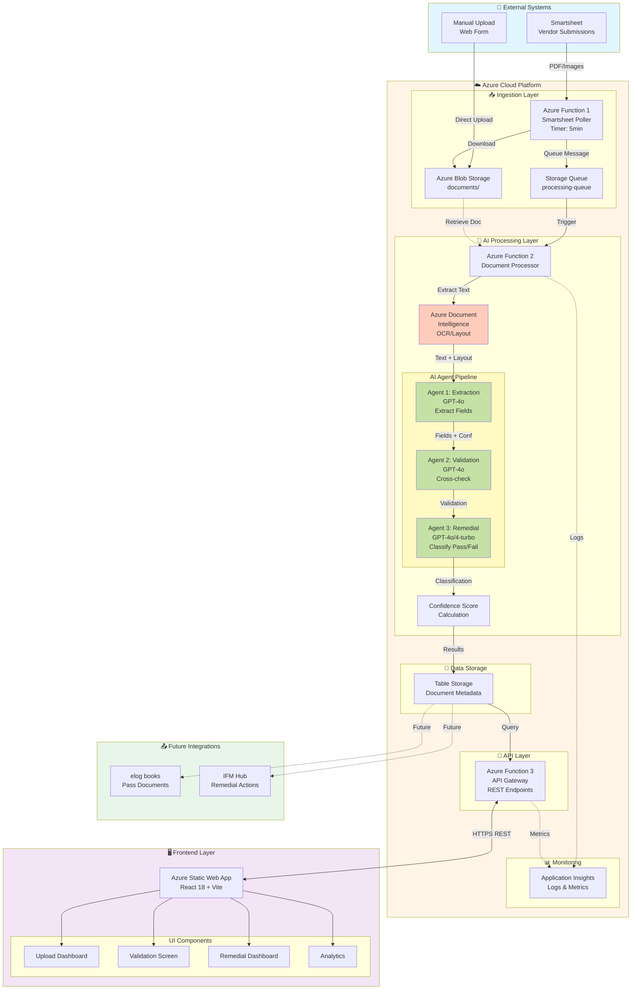
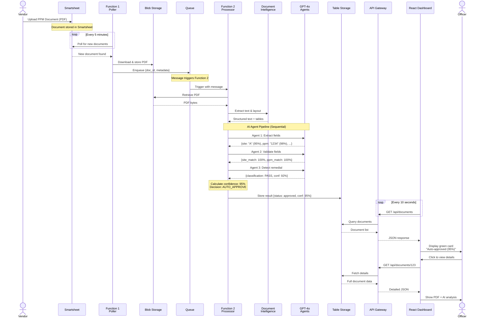
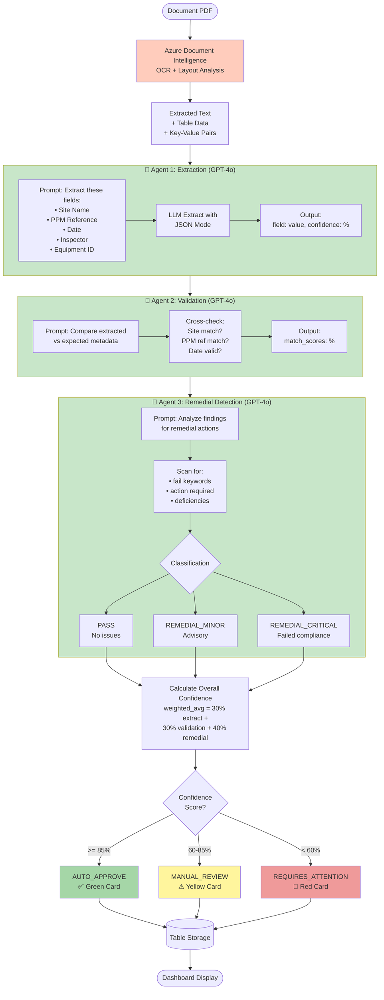
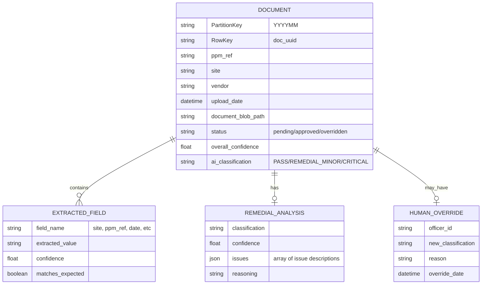
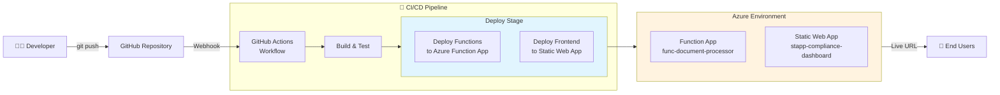
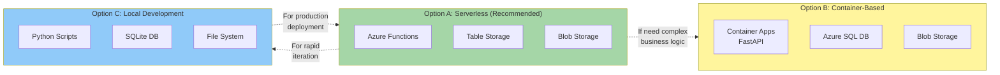

## 🎨 Mermaid Diagrams (Auto-Render in GitHub/VS Code)
  

### **Diagram 1: High-Level System Architecture**

  

  

---

  

### **Diagram 2: Document Processing Sequence (Happy Path)**

  

  

---

  

### **Diagram 3: AI Agent Pipeline (Detailed)**

  

---

  

---

  

### **Diagram 4: Data Model (Entity Relationship)**

  

  

---

  

  

### **Diagram : Alternative Architecture Options**

  

  

---

  

## 📖 How to View Mermaid Diagrams

  

### **In GitHub**

✅ Renders automatically when you view the file on GitHub.com

  

### **In VS Code**

1. Install extension: "Markdown Preview Mermaid Support"

2. Open this file

3. Press `Ctrl+Shift+V` (Preview)

4. Diagrams render inline

  

### **Export to Image**

1. Use https://mermaid.live/

2. Paste diagram code

3. Export as PNG/SVG for presentations

  

---

  

**Diagram Version**: 1.0  

**Last Updated**: April 20, 2026  

**Status**: Ready for Architecture Review
