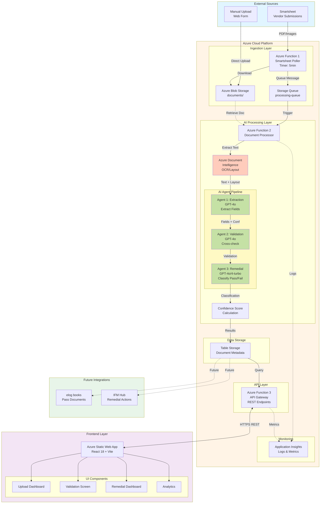
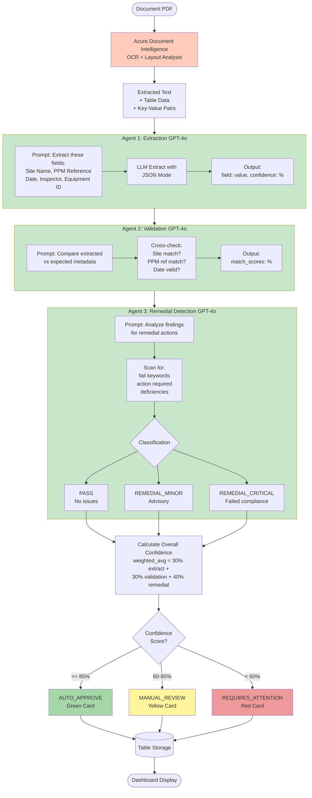
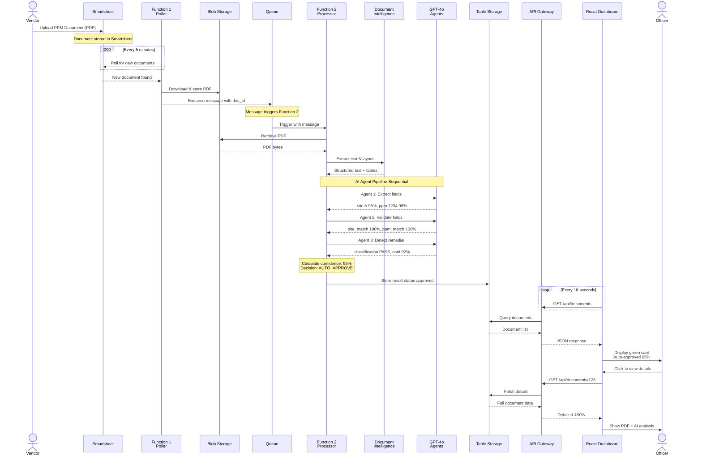
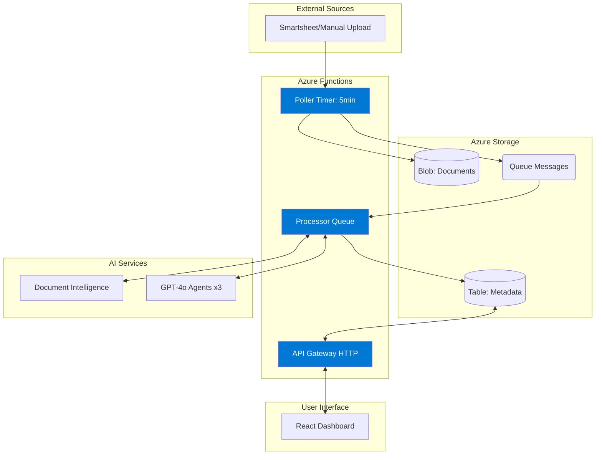
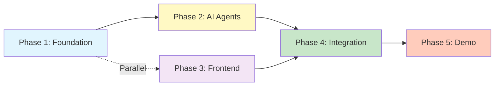

# Hackathon POC: AI-Powered Compliance Paperwork Automation

**Project**: My Compliance Paperwork - Intelligent Document Validation  
**Date**: April 2026  
**Team**: CBRE Innovation Hackathon 2026

---

## EXECUTIVE SUMMARY

Build an AI-powered system that validates statutory PPM compliance documents, extracts key fields, detects remedial actions, and routes to appropriate systems - eliminating 80%+ of manual review work.

**Value Proposition**:
- Reduce processing time from 10-15 minutes to <2 minutes
- Auto-approve 80%+ of documents with 85%+ confidence
- Zero false negatives on critical remedial actions
- Full audit trail with AI decision transparency

**Demo Goal**: Working end-to-end system deployed on Azure

---

## PROBLEM STATEMENT

CBRE facilities management teams manually process hundreds of statutory PPM compliance documents monthly. Vendors submit diverse formats (PDFs, photos, Word docs) via Smartsheet. Officers must:
1. Validate each document (correct site, PPM type, dates)
2. Apply naming conventions
3. Classify as pass or remedial action required
4. Update compliance tracker spreadsheet

**Pain Points**: Bottlenecks, inconsistencies, delays identifying critical safety issues

---

## SOLUTION ARCHITECTURE

**Pipeline Flow**: Vendor uploads → AI processes → Officer reviews → Approve/override → Auto-routes

**Processing Steps**:
1. Ingest documents from Smartsheet (manual upload for demo)
2. Extract text using Azure Document Intelligence
3. Validate fields using GPT agents
4. Detect remedial actions via NLP
5. Calculate confidence scores
6. Enable human override via dashboard
7. Track analytics

---

## TECHNOLOGY STACK

### Backend
- **Runtime**: Azure Functions (Python 3.11) - Serverless, auto-scale, free tier
- **Storage**: Azure Blob (documents) + Table Storage (metadata)
- **Triggers**: Timer (polling) + Queue (processing) + HTTP (API)

### AI/ML
- **Primary LLM**: Azure OpenAI GPT-4o - $2.50/1M tokens, fast (1-2s), excellent JSON mode
- **Fallback LLM**: Azure OpenAI GPT-4-turbo - $10/1M tokens, better reasoning if accuracy <90%
- **Document OCR**: Azure Document Intelligence - Layout/table detection, 500 pages/month free

### Frontend
- **Framework**: React 18 with Vite
- **UI**: Tailwind CSS + shadcn/ui
- **PDF Viewer**: react-pdf
- **State**: TanStack Query (server state) + Context API
- **Hosting**: Azure Static Web Apps (free tier with CI/CD)

### Comprehensive Technology Evaluation

#### 1. OCR/Document Processing Options

| Option | Layout Detection | Tables | Handwriting | Cost | Latency | Complexity | Choice |
|--------|-----------------|--------|-------------|------|---------|------------|--------|
| **Azure Document Intelligence** | Excellent | Yes | Yes | $1.50/1000 pages (500 free/month) | 2-5s | Low (REST API) | **✅ Selected** |
| PyMuPDF + PyPDF2 | Basic text only | No | No | Free | <1s | Low | Fallback for text-only PDFs |
| Tesseract OCR | Poor on scans | No | Fair | Free | 3-10s | Medium (preprocessing needed) | Only if cost-critical |
| AWS Textract | Excellent | Yes | Yes | $1.50/1000 pages | 2-5s | Medium (cross-cloud) | Not recommended (avoid multi-cloud) |

**Decision Rationale**: Azure Document Intelligence selected for superior table extraction, handwriting support, free tier coverage, and seamless Azure ecosystem integration.

---

#### 2. Large Language Model (LLM) Comparison

| Model | Cost (per 1M tokens) | Speed | JSON Mode | Accuracy | Use Case | Choice |
|-------|---------------------|-------|-----------|----------|----------|--------|
| **Azure OpenAI GPT-4o** | $2.50 input / $10 output | Fast (1-2s) | Yes | High (95%+) | Primary agents | **✅ Primary** |
| Azure OpenAI GPT-4-turbo | $10 input / $30 output | Medium (2-4s) | Yes | Very High (98%+) | Remedial detection | **✅ Fallback** |
| GPT-3.5-turbo | $0.50 input / $1.50 output | Very fast (<1s) | Yes | Medium (85%+) | Not sufficient | ❌ Too low accuracy |
| Claude 3 Opus | $15 input / $75 output | Slow (3-6s) | No | Very High | Not available on Azure | ❌ Not integrated |
| Llama 3 70B (open) | Free (self-host) | Medium (2-4s) | No | Medium (88%+) | Complex deployment | ❌ Complexity vs benefit |

**Decision Rationale**: GPT-4o primary (cost/speed balance), GPT-4-turbo fallback for remedial detection requiring higher reasoning (critical safety decisions).

---

#### 3. Backend Runtime Comparison

| Option | Cost | Cold Start | Scaling | Language Support | Local Dev | Choice |
|--------|------|-----------|---------|-----------------|-----------|--------|
| **Azure Functions (Consumption)** | 1M free, $0.20/1M | 2-5s | Auto (0-200) | Python, Node, C# | Yes (local emulator) | **✅ Selected** |
| Azure Container Apps | $0.18/vCPU hour | <1s | Auto (0-300) | Any (Docker) | Yes (Docker) | ⚠️ Overkill for POC |
| Azure App Service | $13/month minimum | None | Manual | Python, Node, C# | Yes | ❌ Not serverless |
| FastAPI + VM | $30+/month | None | Manual | Python | Yes | ❌ Higher cost/complexity |
| AWS Lambda | Similar to Functions | 1-3s | Auto | Python, Node, Java | Yes | ❌ Avoid multi-cloud |

**Decision Rationale**: Azure Functions Consumption Plan provides serverless benefits, generous free tier, Python 3.11 support, and minimal cold start impact for demo.

---

#### 4. Programming Language Options

| Language | AI Library Support | Azure SDK | Team Familiarity | Development Speed | Choice |
|----------|-------------------|-----------|-----------------|-------------------|--------|
| **Python 3.11** | Excellent (OpenAI SDK, LangChain) | Mature | High | Fast | **✅ Selected** |
| Node.js (TypeScript) | Good (OpenAI SDK) | Mature | Medium | Fast | ⚠️ Less AI-friendly |
| C# (.NET 8) | Good (Azure SDKs) | Native | Low | Medium | ❌ Slower prototyping |
| Java | Limited | Mature | Low | Slow | ❌ Verbose for POC |

**Decision Rationale**: Python dominates AI/ML workflows, excellent OpenAI library support, fastest prototyping for 24hr timeframe.

---

#### 5. Document Storage Solutions

| Option | Cost | Scalability | Access Speed | Security | Use Case | Choice |
|--------|------|-------------|--------------|----------|----------|--------|
| **Azure Blob Storage (Hot)** | $0.018/GB | Petabytes | Fast (<100ms) | Azure AD, SAS tokens | PDF/image files | **✅ Selected** |
| Azure Blob Storage (Cool) | $0.01/GB | Petabytes | Medium (200ms+) | Azure AD, SAS tokens | Archived documents | Future tier |
| Azure Files | $0.06/GB | Limited | Fast | SMB/NFS | Not needed | ❌ Expensive |
| Local File System | Free | Limited | Fastest | None | Dev/testing | Dev only |

**Decision Rationale**: Blob Storage Hot tier for fast access, low cost, automatic scaling, and native Azure integration.

---

#### 6. Metadata Database Options

| Option | Cost | Query Complexity | Scalability | Schema Flexibility | Choice |
|--------|------|-----------------|-------------|-------------------|--------|
| **Azure Table Storage** | $0.05/GB | Simple (key/value) | High | Flexible (NoSQL) | **✅ Selected** |
| Azure Cosmos DB | $24/month minimum | Complex (SQL-like) | Very High | Flexible (NoSQL) | ❌ Overkill/expensive |
| Azure SQL Database | $5/month minimum | Complex (SQL) | Medium | Rigid (relational) | ❌ No complex joins needed |
| SQLite (local) | Free | Medium (SQL) | Low | Rigid | Dev/testing only |

**Decision Rationale**: Table Storage sufficient for key-value lookups (document metadata), no complex joins needed, lowest cost, flexible schema for POC iteration.

---

#### 7. Message Queue Solutions

| Option | Cost | Throughput | Ordering | Complexity | Choice |
|--------|------|-----------|----------|------------|--------|
| **Azure Storage Queue** | Included with storage | 2000 msg/s | FIFO | Very Low | **✅ Selected** |
| Azure Service Bus | $0.05/million ops | 5000 msg/s | FIFO + Priority | Medium | ❌ Unnecessary features |
| Azure Event Grid | $0.60/million ops | Very High | No ordering | Medium | ❌ Overkill for POC |
| RabbitMQ (self-hosted) | VM cost | High | Configurable | High | ❌ Operational overhead |

**Decision Rationale**: Storage Queue built into Storage Account (zero marginal cost), sufficient throughput for demo, simple FIFO semantics.

---

#### 8. Frontend Framework Comparison

| Framework | Learning Curve | Component Library | Build Speed | Bundle Size | Choice |
|-----------|---------------|-------------------|-------------|-------------|--------|
| **React 18 + Vite** | Medium | Excellent (shadcn/ui) | Fast (<1s HMR) | Small (tree-shaking) | **✅ Selected** |
| Vue 3 + Vite | Low | Good (Vuetify) | Fast | Small | ⚠️ Less team familiarity |
| Angular 17 | High | Good (Angular Material) | Slow | Large | ❌ Overkill for POC |
| Svelte + SvelteKit | Low | Limited | Fast | Smallest | ❌ Less mature ecosystem |
| Plain HTML/JS | None | None (manual) | Instant | Minimal | ❌ Slow development |

**Decision Rationale**: React industry standard, shadcn/ui provides beautiful pre-built components, Vite enables instant hot-reload (<1s), team has prior experience.

---

#### 9. UI Component Library

| Library | Design System | Customization | Component Count | Accessibility | Choice |
|---------|--------------|---------------|----------------|---------------|--------|
| **shadcn/ui + Tailwind** | Radix UI primitives | Full (copy-paste) | 40+ | Excellent (ARIA) | **✅ Selected** |
| Material-UI (MUI) | Material Design | Limited (theme) | 60+ | Good | ⚠️ Opinionated styling |
| Chakra UI | Custom | Good (tokens) | 50+ | Excellent | ⚠️ Bundle size |
| Ant Design | Ant Design | Limited | 70+ | Good | ❌ Enterprise-heavy |
| Bootstrap React | Bootstrap | Limited | 30+ | Fair | ❌ Dated design |

**Decision Rationale**: shadcn/ui offers copy-paste components (full control), built on accessible Radix UI, modern design, perfect for rapid customization.

---

#### 10. PDF Viewer Library

| Library | Features | Size | React Integration | Annotations | Choice |
|---------|----------|------|------------------|-------------|--------|
| **react-pdf** | Basic viewing, zoom, nav | 200KB | Native hooks | No | **✅ Selected** |
| PDF.js (Mozilla) | Advanced rendering | 400KB | Manual integration | Yes | ⚠️ Overkill |
| PSPDFKit | Commercial-grade | 2MB+ | Good | Yes | ❌ Paid ($3k+/year) |
| pdfobject.js | Embed only | 10KB | Manual | No | ❌ Limited control |

**Decision Rationale**: react-pdf provides zoom/navigation/search with minimal bundle size, sufficient for validation screen requirements.

---

#### 11. State Management Options

| Solution | Complexity | Server State | Type Safety | Caching | Choice |
|----------|-----------|--------------|-------------|---------|--------|
| **TanStack Query + Context** | Low | Yes (auto-refetch) | Excellent (TypeScript) | Built-in | **✅ Selected** |
| Redux Toolkit + RTK Query | High | Yes | Good | Manual | ⚠️ Overkill for POC |
| Zustand | Low | No | Good | Manual | ❌ No server state |
| MobX | Medium | No | Fair | Manual | ❌ Less popular |
| Plain useState | None | No | Good | None | ❌ No caching/refetch |

**Decision Rationale**: TanStack Query auto-handles polling (10s intervals), caching, loading states. Context API sufficient for simple client state (user preferences).

---

#### 12. Frontend Hosting Solutions

| Option | Cost | SSL | CDN | CI/CD | Build Integration | Choice |
|--------|------|-----|-----|-------|------------------|--------|
| **Azure Static Web Apps** | Free tier | Auto | Yes (global) | GitHub Actions | Vite/React auto-detect | **✅ Selected** |
| Azure App Service | $13/month | Manual ($70/year) | No | Manual setup | Generic | ❌ Expensive |
| Netlify | Free tier | Auto | Yes | GitHub/GitLab | Auto | ⚠️ Vendor lock-in |
| Vercel | Free tier | Auto | Yes | GitHub | Auto | ⚠️ Outside Azure |
| GitHub Pages | Free | Auto (HTTPS only) | Limited | GitHub Actions | Manual | ❌ Static only, no API routes |

**Decision Rationale**: Azure Static Web Apps free tier includes auto-SSL, global CDN, GitHub integration, and perfect for single-page React apps.

---

#### 13. Smartsheet Integration Approach

| Option | Real-Time | Setup Complexity | Access Required | Reliability | Choice |
|--------|-----------|-----------------|----------------|-------------|--------|
| **Manual Upload UI** | No (user-triggered) | Very Low | None | User-dependent | **✅ Demo** |
| API Polling (5 min) | Near-real-time | Low | Read-only API key | Good (retry logic) | **✅ Fallback** |
| Smartsheet Webhooks | Yes (instant) | Medium | Admin access + callback URL | Excellent | Production future |
| Email Forwarding + Parsing | No (periodic) | High | Email integration | Poor | ❌ Unreliable |

**Decision Rationale**: Manual upload for demo (no permissions needed), API polling as fallback if access granted, webhooks for production deployment.

---

#### 14. Monitoring & Logging Solutions

| Option | Cost | Setup | Log Query | APM | Alerts | Choice |
|--------|------|-------|-----------|-----|--------|--------|
| **Azure Application Insights** | 5GB/month free | Auto (SDK) | Kusto (KQL) | Yes | Yes | **✅ Selected** |
| Azure Log Analytics | Pay-per-GB | Manual | KQL | Limited | Yes | ⚠️ More complex setup |
| ELK Stack (self-hosted) | VM cost | Very High | Elasticsearch | Yes | Manual | ❌ Operational burden |
| CloudWatch (AWS) | Pay-per-GB | N/A | CloudWatch Insights | Yes | Yes | ❌ Avoid cross-cloud |
| Console.log only | Free | None | None | No | No | ❌ No production visibility |

**Decision Rationale**: Application Insights auto-collects logs/metrics from Functions and Static Web Apps, 5GB free tier sufficient for hackathon, integrated alerting.

---

#### 15. Authentication & Authorization

| Option | Complexity | Cost | User Management | MFA | Choice |
|--------|-----------|------|----------------|-----|--------|
| **Function-Level Keys (Demo)** | Very Low | Free | None | No | **✅ Hackathon** |
| Azure AD B2C | Medium | 50k users free | Built-in | Yes | Production future |
| Auth0 | Low | 7k users free | Built-in | Yes | ❌ External dependency |
| Custom JWT | High | Free | Manual DB | Manual | ❌ Security risk |
| None (open API) | None | Free | None | No | ❌ Insecure |

**Decision Rationale**: Function-level API keys sufficient for demo security. Azure AD B2C planned for production (compliance officers with MFA).

---


## ARCHITECTURE DIAGRAMS

### System Architecture Overview



### AI Agent Pipeline Flow



### Document Processing Sequence



### Azure Resource Hierarchy

```
Azure Subscription: CBRE-Innovation
│
└── Resource Group: rg-hackathon-compliance-poc
    │
    ├── Azure Storage Account: sthackathoncompliance
    │   ├── Blob Container: documents
    │   ├── Table: documents
    │   └── Queue: document-processing-queue
    │
    ├── Azure Function App: func-document-processor
    │   ├── Function 1: SmartsheetPoller (Timer: 0 */5 * * * *)
    │   ├── Function 2: DocumentProcessor (QueueTrigger)
    │   └── Function 3: ApiGateway (HttpTrigger)
    │
    ├── Azure OpenAI Service: aoai-hackathon
    │   ├── Deployment: gpt-4o (chat completion)
    │   └── Deployment: gpt-4-turbo (fallback)
    │
    ├── Azure Document Intelligence: docintel-hackathon
    │   └── Model: prebuilt-read
    │
    ├── Azure Static Web App: stapp-compliance-dashboard
    │   └── Linked to GitHub repo (auto-deploy)
    │
    └── Azure Application Insights: appi-hackathon
        └── Logs, metrics, traces for all services
```

---

## IMPLEMENTATION PHASES

### Phase 1: Foundation
**Goal**: Infrastructure and research ready for development

**Tasks by Team Member**:

**Asif (Cloud Architect)**:
- Set up Azure resource group
- Provision Storage Account (Blob + Table + Queue)
- Deploy Azure OpenAI Service
- Deploy Document Intelligence
- Configure free tier limits

**Vikas + Vansh +Dushyant (Backend)**:
- Create GitHub repository structure
- Build Azure Function skeleton (3 templates: Timer, Queue, HTTP)
- Set up local development environment
- Test basic Azure Functions deployment:
- Research Azure Document Intelligence pricing/quotas
- Test Document Intelligence API with sample PDFs
- Compare GPT-4o vs GPT-4-turbo response quality
- Document sample extraction results

**Himanshi (Product/UX)**:
- Finalize Figma design verbiage (DONE)  
- Get Smartsheet access from business (DONE)
- Gather 5-10 sample documents (mix pass/remedial)
- Document expected fields per document type

**Deliverables**:
- Azure resources provisioned and accessible
- Function app skeleton deployed
- Sample documents ready for testing
- OCR successfully extracting text from samples

---

### Phase 2: AI Intelligence
**Goal**: Build 3-agent AI pipeline with confidence scoring

**Tasks by Team Member**:

**Dushyant + Vikas +vansh (AI Agents)**:
- Build Extraction Agent (GPT-4o): Extract site, PPM ref, date, inspector, equipment
- Build Validation Agent (GPT-4o): Cross-check extracted vs expected metadata
- Build Remedial Detection Agent (GPT-4o): Classify PASS/REMEDIAL_MINOR/CRITICAL
- Create JSON response schemas for each agent

**Dushyant + Himanshi (Confidence Scoring)**:
- Implement confidence calculation logic
- Define threshold scoring (30% extract + 30% validate + 40% remedial)
- Set decision thresholds (85%+ auto-approve, 60-85% review, <60% attention)

**Dushyant (Data Schema)**:
- Design Table Storage schema (documents, extracted fields, analysis)
- Implement CRUD operations for document metadata
- Create data models for AI responses

**Deliverables**:
- 3 working AI agent prompt templates
- JSON responses from all agents validated
- Confidence scoring logic implemented
- Documents successfully saved to Table Storage
- End-to-end processing of 1 sample document

---

### Phase 3: Frontend
**Goal**: User dashboard for reviewing AI decisions

**Tasks by Team Member**:

**Vansh + Vikas (Frontend Development)**:
- Set up React 18 + Vite project
- Install Tailwind CSS + shadcn/ui components
- Build Upload Dashboard with document cards
- Implement color-coding (green/yellow/red by confidence)

**Himanshi (UX Components)**:
- Design DocumentCard component with Figma specs
- Implement validation screen split view layout
- Create override workflow UI

**Vansh (Integration)**:
- Integrate react-pdf viewer with zoom/navigation
- Connect to backend APIs using TanStack Query
- Implement 10-second polling for real-time updates
- Build manual upload form

**Deliverables**:
- Dashboard displaying all processed documents
- PDF viewer showing extracted fields
- Working override buttons (approve/reject)
- Real-time updates from backend API
- Match Figma design specifications

---

### Phase 4: Integration & Testing
**Goal**: End-to-end system working seamlessly

**Tasks by Team Member**:

**Vikas + Vansh (Integration)**:
- Implement manual upload API endpoint (POST /api/upload)
- Build analytics calculation logic (GET /api/analytics)
- Connect Smartsheet API polling (future/fallback)
- Integrate all API endpoints (GET/PUT documents)

**All Team (Testing)**:
- Test 5 pass documents (target >85% auto-approval)
- Test 3 remedial documents (100% detection)
- Test officer override workflow
- Verify data persistence across refreshes
- Performance testing (<2 min processing time)

**Asif + Vikas (Deployment)**:
- Set up CI/CD pipeline (GitHub Actions)
- Deploy Functions to Azure
- Deploy Static Web AppDeploy Function App to Azure
- Configure application settings/secrets
- Warm services to avoid cold starts

**Deliverables**:
- Full document processing flow working
- Live deployment on Azure with shareable URL
- All test scenarios passing
- Sub-2 minute processing time per document
- Analytics dashboard showing KPIs

---


## ARCHITECTURE OVERVIEW

### System Components



### Phase Dependencies



**Critical Path**:
- Phase 2 depends on Phase 1 (needs Azure OpenAI deployed)
- Phase 4 depends on Phases 2 & 3 (needs API + UI ready)
- Phase 3 can start early (parallel to Phase 2)

**Parallel Work Opportunities**:
- Phase 1: All team members work independently
- Phases 2-3: Frontend development parallel to AI agent work
- Phase 5: Demo prep while infrastructure stabilization

---

## FILES TO CREATE

**Backend** (`src/`):
- `agents/extraction_agent.py` - GPT-4 field extraction
- `agents/validation_agent.py` - Metadata cross-check
- `agents/remedial_detection_agent.py` - Pass/fail classification
- `functions/smartsheet_poller.py` - Timer trigger (5 min)
- `functions/document_processor.py` - Queue trigger processing
- `functions/api_gateway.py` - HTTP endpoints (GET/PUT/POST)

**Frontend** (`frontend/src/`):
- `components/DocumentCard.jsx` - Card with confidence display
- `components/ValidationScreen.jsx` - PDF + analysis split view
- `components/AnalyticsDashboard.jsx` - KPI displays

**Testing**:
- `demo_samples/` - 10 anonymized test documents (5 pass, 3 remedial, 2 edge cases)

---


