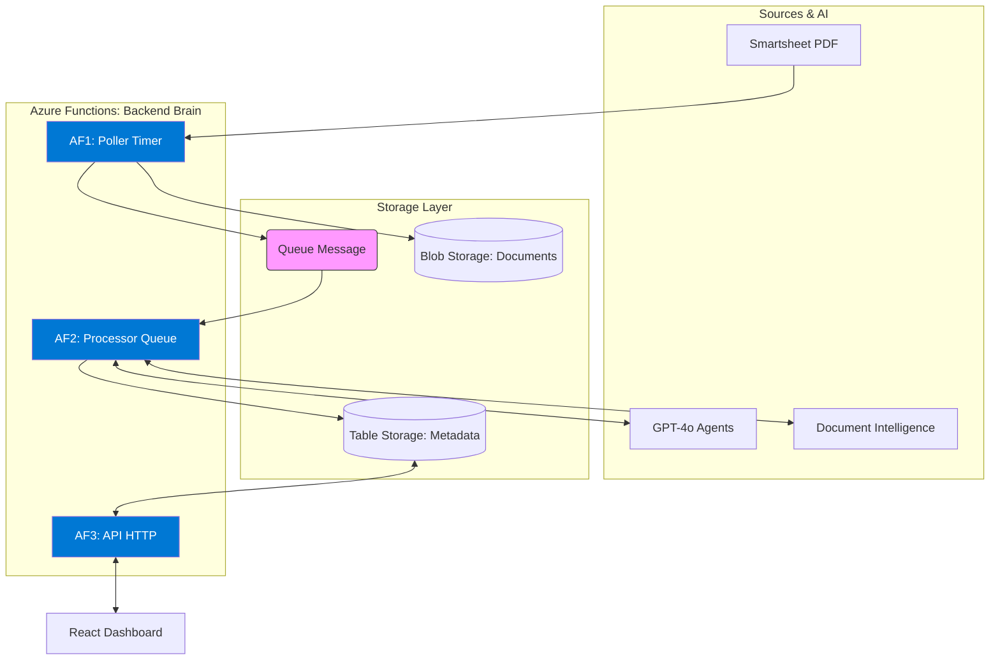
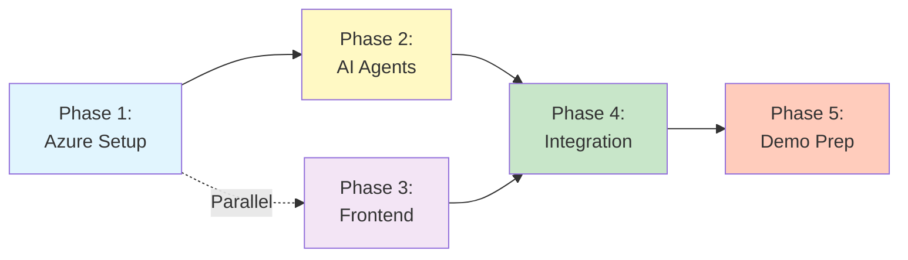
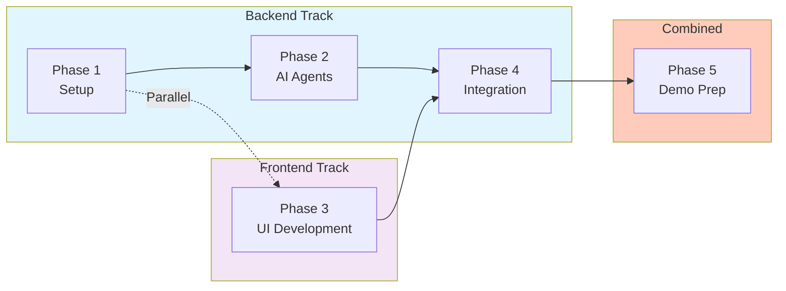
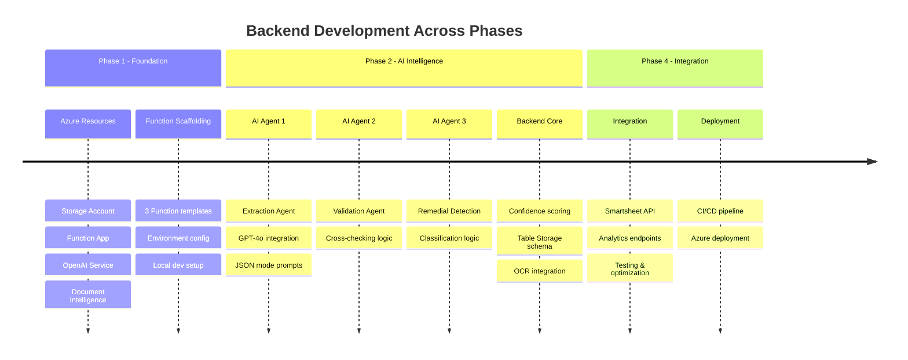
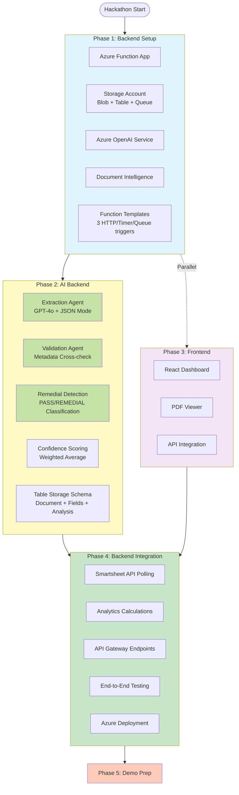
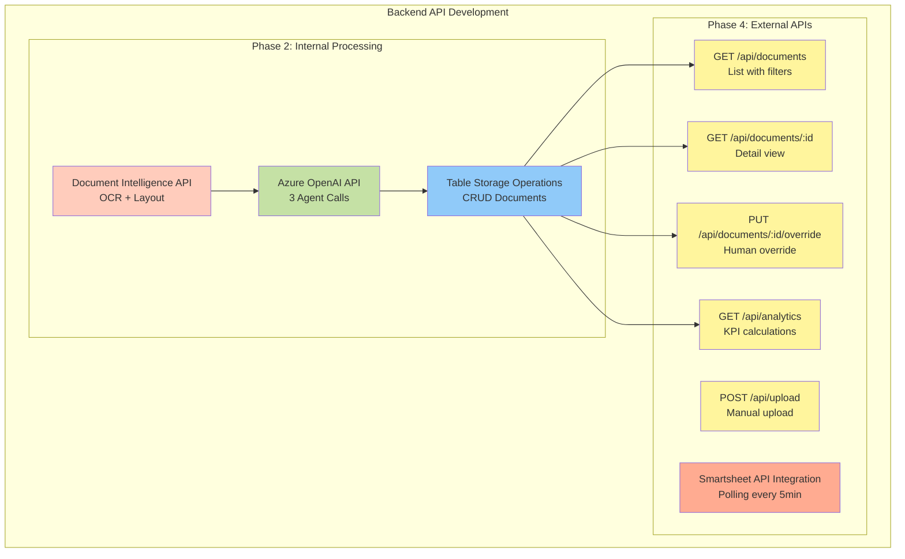

# Hackathon POC: AI-Powered Compliance Paperwork Automation

**Project Name**: My Compliance Paperwork - Intelligent Document Validation
**Date**: April 2026
**Team**: CBRE Innovation Hackathon 2026

---

## EXECUTIVE SUMMARY

Build an AI-powered system that automatically validates statutory PPM compliance documents, extracts key fields, detects remedial actions, and routes to appropriate systems - eliminating 80%+ of manual review work while maintaining audit compliance.

**Value Proposition**:
- Reduce document processing time from 10-15 minutes to <2 minutes
- Auto-approve 80%+ of documents with 85%+ confidence
- Zero false negatives on critical remedial actions
- Full audit trail with AI decision transparency

**Demo Goal**: Working end-to-end system deployed on Azure with live document processing

---

## PROBLEM STATEMENT

CBRE facilities management teams manually process hundreds of statutory PPM (Planned Preventive Maintenance) compliance documents monthly. Vendors submit diverse formats (PDFs, photos, Word docs) via Smartsheet, and compliance officers must:
1. Manually validate each document (correct site, PPM type, dates)
2. Apply naming conventions
3. Classify as pass (satisfactory) or requires remedial action
4. Update separate compliance tracker spreadsheet

**Pain Points**: Bottlenecks, inconsistencies, delays in identifying critical safety issues

---

## SOLUTION OVERVIEW

An intelligent document processing pipeline that:
1. **Ingests** vendor documents from Smartsheet (manually/webhook)
2. **Extracts** structured data using Azure Document Intelligence or any othe rmech
3. **Validates** fields against metadata using GPT agents
4. **Detects** remedial actions via NLP analysis
5. **Scores** confidence and routes automatically
6. **Enables** human override via dashboard
7. **Tracks** analytics and accuracy

**User Journey**: Vendor uploads → AI processes → Officer reviews dashboard → Approve/override → Auto-routes to elog books/IFM Hub

---


## IMPLEMENTATION PHASES

### Phase  Foundation  *parallel work*

We would have a research hour (inidvidualy), and tru to find the best option of the technology we can use.
Here are the option addording to me

## TECHNOLOGY STACK (Detailed Comparison)

**Integration Decision**:
| Option | Pros | Cons | Chosen |
|--------|------|------|--------|
| Smartsheet Webhook | Real-time, no polling | Requires admin access |  Too risky |
| API Polling (5min) | Simple, read-only | Slight delay | Fallback |
| **Manual Upload UI** | Works without access, demo-friendly | Not "real" integration | Safest for demo |

**Recommendation**: Build upload UI with "Imported from Smartsheet" label, explain webhook for production

###  **1.Document OCR / Text Extraction**

| Option | Layout Detection | Table Extraction | Handwriting | Cost | Setup | Recommendation |
|--------|-----------------|------------------|-------------|------|-------|----------------|
| **Azure Document Intelligence** | Excellent | Excellent | Yes | $1.50/1000 pages | Easy (API) | **Best** |
| Tesseract OCR | Poor | No |  Fair | Free | Medium (local install) | If cost critical |
| AWS Textract | Good | Good | Yes | $1.50/1000 pages | Easy (API) | If using AWS |
| PyMuPDF + PyPDF2 | Basic | No | No | Free | Easy (pip install) | For text-only PDFs |
| Google Document AI | Excellent | Excellent | Yes | $1.50/1000 pages | Easy (API) | If using GCP |

**Chosen**: **Azure Document Intelligence** (Form Recognizer) - Best layout/table detection, same cloud as LLM

**Free Tier**: 500 pages/month (sufficient for demo)


###  **2.Backend Runtime / Compute**

| Option | Complexity | Cost | Demo Reality | Learning Curve | Recommendation |
|--------|-----------|------|--------------|----------------|----------------|
| **Azure Functions (Python)** | Low | Free | High (live URL) | Low (just Python with decorators) |  **Best** |
| FastAPI + Container Apps | Medium | $10/month | High (live URL) | Medium |  If team knows FastAPI |
| Flask + App Service | Medium | $5/month | High (live URL) | Low |  If avoiding serverless |
| Pure Python Script | Very Low | Free | Medium (run on laptop) | Very Low |  **Fastest for demo** |

**Chosen**: **Azure Functions (Python 3.11)** - Serverless, auto-scale, free tier, minimal wrapper around Python

### **3.LLM Models**

| Model | Speed | Cost | Accuracy | JSON Mode | Context | Use Case | Recommendation |
|-------|-------|------|----------|-----------|---------|----------|----------------|
| **GPT-4o** | Fast (1-2s) | $2.50/1M tokens | Very Good | Excellent | 128k | Extraction, Validation | **Primary** |
| GPT-4-turbo | Slower (3-5s) | $10/1M tokens | Excellent | Good | 128k | Remedial Detection | **Fallback** |

### **4.Programming Language**

| Language | Ecosystem | AI/ML Libraries | Azure Integration | Team Familiarity | Recommendation |
|----------|-----------|-----------------|-------------------|------------------|----------------|
| **Python 3.11** | Excellent | Best (openai, transformers, pandas) | Native support | High |  **Best** |

---


### AI/ML Layer
- **Primary LLM**: Azure OpenAI GPT-4o (extraction, validation) - Fast, cheap, good JSON mode
- **Fallback LLM**: Azure OpenAI GPT-4o (remedial detection) - Better reasoning if needed
- **Document OCR**: Azure Document Intelligence - Layout detection, table extraction(we may use some other mech to do that)
- **Prompts**: Custom Python templates (no framework overhead)

### Backend
- **Runtime**: Azure Functions (Python 3.11) - Serverless, auto-scale, free tier
- **Storage**: Blob (documents) + Table Storage (metadata) - Cheapest option
- **Triggers**: Timer (poll) + Queue (process) + HTTP (API)

### Frontend
- **Framework**: React 18 
- **UI**: Tailwind CSS + shadcn/ui - Rapid prototyping
- **PDF Viewer**: react-pdf
- **Hosting**: Azure Static Web Apps - Free tier with CI/CD


**Tasks**:
1. Set up Azure resources — **Cloud Architect- Asif is checking that**
2. Get Create sample documents — **Already have that** 
3. Build Azure Function Skeleton Code — **Vikas and Vansh can check**

   Backend skeleton




5. Revision all existing models that are pretrained and we can use eg Azure Document Intelligence — **Dushyant**
   

---

##  SUCCESS METRICS

**Demo Success**:
- End-to-end flow: Upload → AI Process → Review → Override → Route
- Live on Azure with shareable URL
- 80%+ accuracy on sample documents
- Clear confidence scores and reasoning shown
- professional UI matching Figma designs

**Business Success** (Post-Hackathon):
- 80%+ automation rate on real documents
- 90%+ accuracy with <10% override rate
- 10x time savings (10min → <1min per document)
- $50k+ annual savings per compliance officer (time value)

---

## NEXT ACTIONS

**Pre-work**: All team members review this document and come with questions

### Product - Himanshi:
1. Finalize Figma verbiage based on this plan --done
2. Get Smartsheet access from business stakeholders -- done
3. identify 5-10 anonymized sample documents (mix of pass/remedial) -Anil can acess them but we need one alomost all cases
4. Document expected fields per document type - can we get these from buisness?

   
## Frontend Vansh, Vikas
1. go through the figma and try to implement Frontend part
2. React dashboard skeleton — **UX/BA Lead**
3. Document cards with color coding — **Frontend**
4. Validation screen + PDF viewer — **Frontend**
5. API integration — **Frontend**
6. Override workflow — **Full Stack Developer**

### Backend - Dushyant/Vansh:
1. Design detailed architecture diagram with data flows --> drafted
2. Create phase-wise braeakdown ->  drafted
3. create up GitHub repository  --> done, will setup as we go through the coding
4. Research Azure Document Intelligence pricing/quotas -> in process
5. Compare GPT-4o vs GPT-4-turbo on samples


### AI Intelligence - Dushyant/ Himanshi(scoring threshold)/Vikas

**Tasks**:
5. Extraction agent prompts  
6. Validation agent prompts  
7. Remedial detection agent 
8. Confidence scoring calculation
9. Table Storage schema 
   
### Cloud Vikas , Asif, :
1. Set up Azure resource group
2. Configure storage accounts, verify free tier limits


### All Team:
1. Review this plan, provide feedback
2. Identify missing requirements or blockers
3. Confirm tool access (Azure, Smartsheet, GitHub)
4. Block calendar for hackathon focused time

---

## NEXT MEETING (Suggested: Tuesday tomorrow Mid-Sprint)

**Agenda**:
1. Review detailed architecture diagram (15 min)
2. Finalize technology stack decisions (10 min)
3. Assign specific tasks with time estimates (15 min)
4. Set up development environment together (20 min)
5. Q&A, blockers, risks (10 min)


**New Files to Create**:
- `src/agents/extraction\\\\\\\_agent.py` - GPT-4 field extraction
- `src/agents/validation\\\\\\\_agent.py` - Metadata cross-check
- `src/agents/remedial\\\\\\\_detection\\\\\\\_agent.py` - Pass/fail classification
- `src/functions/smartsheet\\\\\\\_poller.py` - Timer trigger
- `src/functions/document\\\\\\\_processor.py` - Queue trigger
- `src/functions/api\\\\\\\_gateway.py` - HTTP endpoints
- `frontend/src/components/DocumentCard.jsx`
- `frontend/src/components/ValidationScreen.jsx`
- `demo\\\\\\\_samples/` - Anonymized test documents

---


# Implementation Phases - Hackathon POC

## Phase Timeline

```
┌──────────────────────────────────────────────────────────────────────────┐
│                          HACKATHON PHASES                                 │
└──────────────────────────────────────────────────────────────────────────┘

┌──────────┐          ┌──────────┐         ┌──────────┐         ┌──────────┐       ┌──────────┐
│  PHASE 1 │  ──────> │  PHASE 2 │  ────> │  PHASE 3 │  ────>  │  PHASE 4 │ ────> │  PHASE 5 │
│Foundation│          │    AI    │         │ Frontend │         │Integration│       │Demo Prep │
└──────────┘          └──────────┘         └──────────┘         └──────────┘       └──────────┘

 Setup &              Agent             React Dashboard        End-to-End         Rehearsal &
Infrastructure      Development          + PDF Viewer         Testing + Deploy     Polish
```

---

## Phase Breakdown

### **Phase 1: Foundation**
**Goal**: Infrastructure ready for AI development

**Parallel Workstreams**:
- **Cloud Architect**: Provision Azure resources (Storage, Functions, OpenAI, Document Intelligence)
- **UX/BA Lead**: Create 5-10 sample documents (mix of pass/remedial)
- **Backend Lead**: Azure Function scaffolding with 3 function templates
- **AI Engineer**: Test Document Intelligence API with sample PDFs

**Deliverables**:
- Azure resources deployed
- Sample documents ready
- Function app skeleton running
- OCR successfully extracting text

**Tech Decisions Made**: OCR choice, backend runtime, storage type, frontend host

---

### **Phase 2: AI Intelligence**
**Goal**: 3-agent pipeline processing documents end-to-end

**Tasks**:
- Build **Extraction Agent** (GPT-4o): Pull site, PPM ref, date, inspector, equipment
- Build **Validation Agent** (GPT-4o): Cross-check extracted vs expected metadata
- Build **Remedial Detection Agent** (GPT-4o): Classify PASS/REMEDIAL_MINOR/CRITICAL
- Implement **Confidence Scoring**: Weighted average (30% extract + 30% validate + 40% remedial)
- Design Table Storage schema with all fields

**Deliverables**:
- 3 working prompt templates
- JSON responses from all agents
- Confidence scoring logic
- Documents saved to Table Storage

**Model Decision**: Start with GPT-4o for all agents; switch remedial to GPT-4-turbo if accuracy <90%

---

### **Phase 3: Frontend**
**Goal**: User-friendly dashboard for reviewing AI decisions

**Parallel with Phase 2 End**:
- **Frontend Developer**: React + Vite setup, Tailwind + shadcn/ui installation
- **UX/BA Lead**: Implement DocumentCard component with color-coding

**Main Development**:
- Build **Upload Dashboard**: Grid of cards (green/yellow/red by confidence)
- Build **Validation Screen**: Split view (PDF left, AI analysis right)
- Integrate **react-pdf** viewer with zoom/navigation
- Connect to backend APIs with TanStack Query (10s polling)
- Implement **Override Workflow**: Approve/reject AI decisions

**Deliverables**:
- Dashboard showing all documents
- PDF viewer with AI extracted fields
- Working override buttons
- Real-time updates from backend

**UI Decision**: Tailwind + shadcn/ui for rapid prototyping

---

### **Phase 4: Integration & Polish**
**Goal**: End-to-end system working seamlessly

**Integration Work**:
- Smartsheet integration (or manual upload fallback UI)
- Analytics calculations (processed count, auto-approve %, time saved)
- End-to-end testing with all 10 sample documents
- Performance optimization (cold start, caching, batch processing)
- Azure deployment with CI/CD pipeline

**Testing Scenarios**:
1. Upload 5 pass docs → All auto-approved (>85% confidence)
2. Upload 3 remedial docs → All flagged with issues extracted
3. Officer override test → Changes reflected in dashboard
4. Refresh test → Data persists correctly

**Deliverables**:
- Full document flow working
- Deployed to Azure (live URL)
- All test cases passing
- Sub-2min processing time per doc

**Integration Decision**: Manual upload UI with "Imported from Smartsheet" label (safest for demo)

---

### **Phase 5: Demo Prep**
**Goal**: Flawless 5-minute demo ready with backup plan

**Preparation**:
- **Product Manager**: Write demo script (problem → solution → tech → impact)
- **Cloud Architect**: Pre-load 15 documents, warm all Azure services (avoid cold starts)
- **UX/BA Lead**: Record backup video (if live demo fails)
- **All Team**: Prepare judge Q&A answers (15 anticipated questions)
- **Full Team**: 3× full rehearsals (5 min each)

**Demo Flow**:
1. **Problem** (30s): Show messy vendor PDFs, explain manual process pain
2. **Upload** (1 min): Upload new doc, show AI processing in real-time
3. **Dashboard** (1 min): Walk through color-coded cards, confidence scores
4. **Validation** (1.5 min): Deep dive into one doc - PDF + extracted fields + remedial analysis
5. **Override** (30s): Show officer can override AI decision
6. **Analytics** (30s): Show KPIs (80% auto-approved, 38 hours saved)
7. **Tech Stack** (30s): Quick architecture diagram, mention Azure + GPT-4o

**Judge Q&A Prep**:
- What if AI is wrong? → Human override + confidence thresholds
- Cost at scale? → $10-15/1000 docs (detailed breakdown ready)
- Why not open-source models? → Speed + JSON mode (show comparison table)
- Security concerns? → Azure Key Vault + Managed Identity
- Production timeline? → 2-4 weeks with Smartsheet webhook + Azure AD

**Deliverables**:
- 5-minute demo script memorized
- Backup video recorded
- Services warmed (no cold starts)
- Judge Q&A cheat sheet
- Team confident and rested

---

## Success Metrics

| Metric | Target | Status |
|--------|--------|--------|
| **Auto-Approval Rate** | 80%+ on pass docs | Test in Phase 4 |
| **Remedial Detection** | 100% (zero false negatives) | Validate in Phase 4 |
| **Processing Time** | <2 min per doc | Benchmark in Phase 4 |
| **Confidence Accuracy** | Matches human judgment 85%+ | Compare in Phase 4 |
| **Demo Success** | No failures, <5 min | Rehearse in Phase 5 |
| **Budget** | <$15 total Azure costs | Monitor in Phase 5 |

---

## Critical Path & Dependencies

### **Phase Dependency Flow**



---

### **Backend vs Frontend Work Distribution**



---

### **Detailed Component Timeline**



---

### **Backend Component Breakdown**



---

### **Backend API Endpoints Development**



**Critical Blockers**:
- Phase 2 depends on Phase 1 (need Azure OpenAI deployed)
- Phase 4 depends on Phase 2 & 3 (need API + UI ready)
- Phase 3 can start early (doesn't block backend work)

**Parallel Work Opportunities**:
- Hours 1-8: All 4 team members work independently
- Hours 17-24: Frontend + final AI tuning happen simultaneously
- Hours 37-48: Demo prep while Cloud Architect stabilizes deployment

---

## Communication Checkpoints

| Checkpoint | Purpose |
|-----------|---------|
| **End of Phase 1** | Show Azure resources + sample docs + OCR working |
| **End of Phase 2** | Show AI agents processing 1 doc end-to-end |
| **End of Phase 3** | Show complete UI with API integration |
| **End of Phase 4** | Full system test with all sample docs |
| **Demo Rehearsal 1** | Practice full 5-minute demo |
| **Demo Rehearsal 2** | Iron out rough spots |
| **Final Rehearsal** | Camera-ready, timed performance |

---

**Last Updated**: April 20, 2026  
**Team Size**: 4 people (combined roles)  
**Phases**: 5 sequential phases with parallel work opportunities
